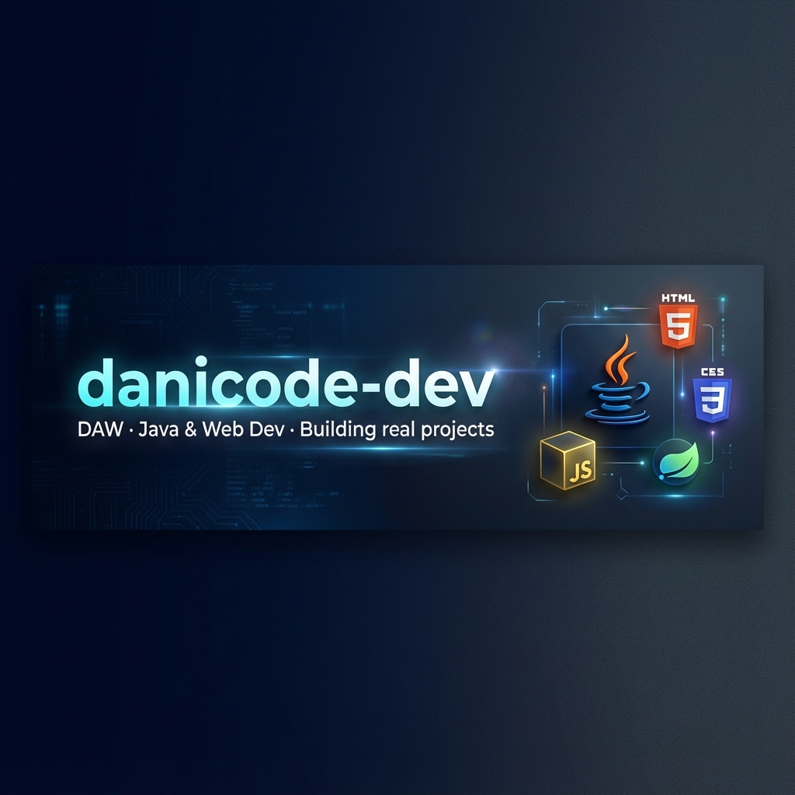

<!-- HERO SECTION -->

  <picture>
    <source media="(prefers-color-scheme: dark)" srcset="profile/assets/banner-dark.png">
    <source media="(prefers-color-scheme: light)" srcset="profile/assets/banner-light.png">
    
  </picture>

  
   
  
  
  &nbsp;
  
  &nbsp;
  <a href="mailto:contact@example.com"> <!-- Update if user provides email, otherwise leave generic or remove -->
    
  </a>

    

  

 

<!-- ABOUT ME & TECH STACK -->
<table border="0" width="100%">
  <tr>
    <td width="55%" valign="top">
      <h3>👋 Hi, I'm Daniel García Ortega</h3>
      

        I'm a <b>DAW student</b> and passionate <b>Java & Web Developer</b> based in Granada, Spain. I focus on building real-world applications with clean code and modern architectures.
      

      <ul>
        <li>🔭 I’m currently working on <b>Full Stack Web Apps</b>.</li>
        <li>🌱 I’m currently learning <b>Spring Boot & Advanced React</b>.</li>
        <li>⚡ Fun fact: I love optimizing algorithms for speed.</li>
      </ul>
       
      <b>My Tech Stack:</b>  
      
    </td>
    <td width="45%" valign="center">
      

        <!-- Coding animation -->
        
      

    </td>
  </tr>
</table>

 

<!-- FEATURED PROJECTS -->
<h2 align="center">🚀 Featured Projects</h2>

  <table>
    <tr>
      <td width="33%" align="center" valign="top">
        
         
        <h3>⌨️ Typing Test</h3>
        
Real-time typing speed test inspired by Monkeytype.

        

          
          
        

        
      </td>
      <td width="33%" align="center" valign="top">
        
         
        <h3>🕹️ Hangman Game</h3>
        
Classic game with time trials and local stats.

        

          
          
        

        
      </td>
      <td width="33%" align="center" valign="top">
        
         
        <h3>📝 Smart Form</h3>
        
Complex validation logic without HTML5 attributes.

        

          
          
        

        
      </td>
    </tr>
  </table>

 

<!-- GITHUB STATS -->
<h2 align="center">📊 GitHub Analytics</h2>

  
  

 

<!-- CONTRIBUTION SUMMARY -->
<h3 align="center">📅 Contribution Summary</h3>

  <!-- Commits by Month -->
  
  
  
    
  
  <!-- Year Overview -->
  
  
  
  
   
  📆 Resumen de actividad anual · Commits por hora y lenguaje

  

  Designed by <b>danicode-dev</b> · 2025

