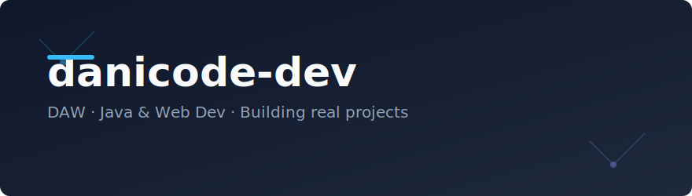
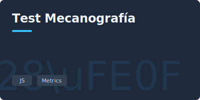
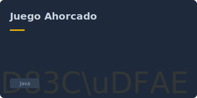
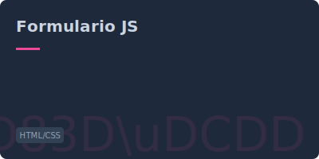

  

  <h3>DAW · Java & Web Dev · Building real projects</h3>
  
  
  

 

  <!-- HERO DEMO: TEST MECANOGRAFIA -->
  
  
    

  <!-- QUICK LINKS (Other Demos) -->
  
  &nbsp;
  
  &nbsp;
  

 

---

<!-- PROJECTS:START -->
## Proyectos Destacados

<table>
  <tr>
    <td width="50%" valign="top">
      
    </td>
    <td valign="top">
      <h3 style="margin-top:0">Test de Mecanografía</h3>
      
Test de velocidad de escritura estilo Monkeytype con métricas en tiempo real.

      
<b>Tech:</b> <code>HTML</code> · <code>CSS</code> · <code>JavaScript</code>

       
       &nbsp; 
    </td>
  </tr>
</table>
 

<table>
  <tr>
    <td width="50%" valign="top">
      
    </td>
    <td valign="top">
      <h3 style="margin-top:0">Ahorcado</h3>
      
Juego completo con modos (Clásico, Contrarreloj), logros y estadísticas locales.

      
<b>Tech:</b> <code>Java</code> · <code>HTML</code> · <code>CSS</code> · <code>JavaScript</code>

       
       &nbsp; 
    </td>
  </tr>
</table>
 

<table>
  <tr>
    <td width="50%" valign="top">
      
    </td>
    <td valign="top">
      <h3 style="margin-top:0">Formulario JS</h3>
      
Formulario de registro con validaciones exhaustivas (sin HTML5 attributes) y efectos visuales.

      
<b>Tech:</b> <code>HTML</code> · <code>CSS</code> · <code>JavaScript</code>

       
       &nbsp; 
    </td>
  </tr>
</table>
 
<!-- PROJECTS:END -->

 

  <h3>🛠️ Tech Stack</h3>
  

 

  
   
  

 
 

  <a href="projects/README.md">Ver todos los proyectos</a> · Diseñado por danicode-dev

