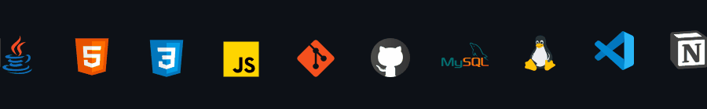
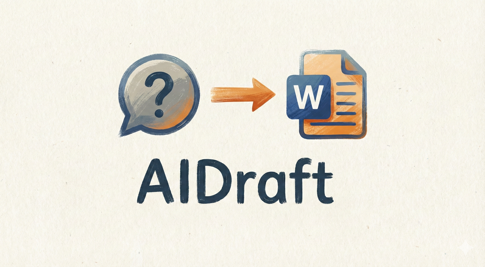

<!-- HERO_START -->

###  Hi, I'm Daniel García Ortega

**DAW student** 

🔭 Working on **Full Stack Web Apps**  
🌱 Learning **Spring Boot & React**  
⚡ I love optimizing algorithms!

  
  &nbsp;
  
  &nbsp;
  
  &nbsp;
  
  &nbsp;
  

<!-- HERO_END -->

 

<!-- TECH STACK -->
### 🛠️ Tech Stack

  

  

<!-- FEATURED PROJECTS -->
<h2 align="center">🚀 Featured Projects</h2>

  <table>
    <tr>
      <td width="80%" align="center" valign="top">
        
         
        <h3>🧠 AIDraft</h3>
        
Preguntas a Word con IA: genera borradores académicos desde PDF/TXT, los edita y los exporta a .docx.

        

          
          
          
          
          
        

        
      </td>
    </tr>
  </table>

 

<!-- GITHUB STATS -->
<h2 align="center">📊 GitHub Analytics</h2>

  
  

 

<!-- CONTRIBUTION SUMMARY -->
<h3 align="center">📅 Contribution Summary</h3>

  
  
   
  
  
  
   
  📆 Annual activity overview

  

  Designed by <b>danicode-dev</b> · 2025

