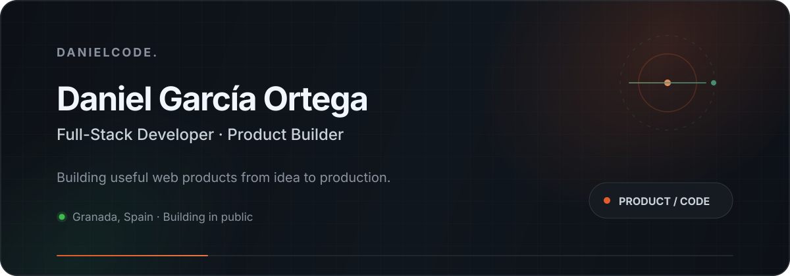

<p align="center">
  
</p>

<p align="center">
  <a href="https://danielcode.dev"><strong>Website</strong></a>
  &nbsp;·&nbsp;
  <a href="https://github.com/danicode-dev?tab=repositories"><strong>View all projects</strong></a>
  &nbsp;·&nbsp;
  <a href="https://www.linkedin.com/in/daniel-garcÍA-ortega-404754385/"><strong>LinkedIn</strong></a>
  &nbsp;·&nbsp;
  <a href="mailto:webdaniel2025@gmail.com"><strong>Email</strong></a>
</p>

---

## Selected work

<table>
<tr>
<td width="66%" valign="top">

### AL-LÍO

**A digital workspace for vocational students.**

AL-LÍO brings tasks, calendar, learning resources, opportunities and useful professional information into one focused product.

`Next.js` · `React` · `TypeScript` · `PostgreSQL` · `Google APIs` · `Docker` · `Caddy`

<a href="https://al-lio.danielcode.dev"><strong>Live product ↗</strong></a>
&nbsp;&nbsp;&nbsp;
<a href="https://github.com/danicode-dev/al-lio"><strong>Repository ↗</strong></a>

</td>
<td width="34%" valign="top">

**STATUS**  
Production

**ROLE**  
Product · Design · Engineering

**FOCUS**  
Education · Productivity · Opportunities

</td>
</tr>
</table>

<p align="right">
  <a href="https://github.com/danicode-dev?tab=repositories"><strong>View all projects →</strong></a>
</p>

---

## Expertise

<table>
<tr>
<td width="25%" valign="top">

**01 · PRODUCT**

UX direction  
Interface systems  
Product architecture

</td>
<td width="25%" valign="top">

**02 · ENGINEERING**

Next.js  
React  
TypeScript  
APIs

</td>
<td width="25%" valign="top">

**03 · BACKEND**

Node.js  
PostgreSQL  
OAuth  
Integrations

</td>
<td width="25%" valign="top">

**04 · INFRA**

Docker  
VPS  
Caddy  
CI/CD

</td>
</tr>
</table>

---

## Currently building

```text
AL-LÍO              → product for vocational students
Web products        → full-stack applications with real deployment
AI workflows        → practical integrations and automation
Infrastructure      → Docker, PostgreSQL, VPS and production operations
```

---

## Activity

<p align="center">
  
</p>

<p align="center">
  <sub>Daniel García Ortega · danicode-dev · 2026</sub>
</p>
